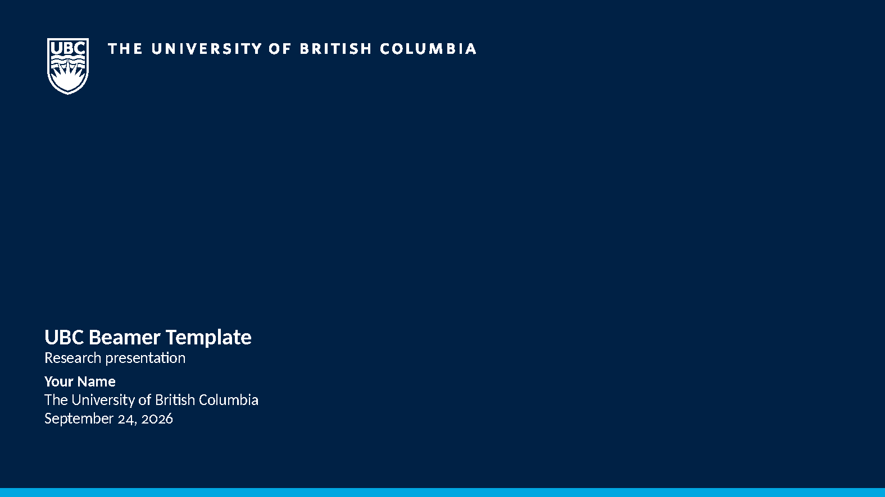

# UBC-Beamer-Template

This is a beamer template adapted for the University of British Columbia (UBC).

## Files

- `beamerUBC.tex`: packages, presentation metadata and document entry point.
- `slides/demo.tex`: the example slides; replace these with your own content.
- `beamerthemeubc.sty`: page layout, cover, headers, footers and existing commands.
- `ubccolor.sty`: UBC blues plus neutral and semantic colours.
- `assets/ubc/`: vector logos and the Vancouver campus photograph.
- `assets/ubc/SOURCES.md`: source URLs and asset notes.
- `cover.png`: README cover image.
- `bibliography.bib`: example references.

## Acknowledgments & License
This template is modified from [CUHK-Beamer-Template](https://www.overleaf.com/latex/templates/xiang-gang-zhong-wen-da-xue-zhong-wen-mo-ban-cuhk-beamer-template/bpgghjpjkqxw) by Richard Fury.

Modifications by Haonan Bai are licensed under [CC BY 4.0](https://creativecommons.org/licenses/by/4.0/).
